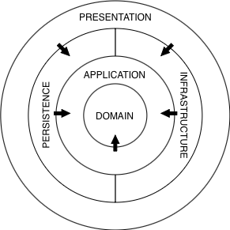

# Warehouse Management System

A RESTful backend API designed for a multi-location clothing retail chain operating across different regions of Turkey. The system focuses specifically on warehouse management and product transfer operations — tracking inbound deliveries from suppliers, outbound shipments to stores, physical inventory counts, stock levels, and waste records.

> **Note:** This project is under active development. As a second phase, Claude Code was used to write characterization and domain-level unit tests, standardize API response formats through global exception handling, and move business rules out of command handlers into the domain layer. Query handlers' role-based data visibility — split between filter construction and post-fetch checks — was intentionally left in the application layer for now and will be revisited in a later pass.

---

## Tech Stack
* .NET 10
* ASP.NET Core
* Entity Framework Core
* PostgreSQL
* ASP.NET Core Identity + JWT Bearer
* Fluent Validation
* MediatR
* Docker Compose

--- 

## Access Control

The system defines three roles: `LogisticDirector`, `WarehouseManager`, and `WarehouseStaff`. All employee accounts are created by the Logistics Director and accessed with passwords automatically generated by the system, so users are required to change their passwords before performing any operations. Additionally, `WarehouseManager` and `WarehouseStaff` accounts must be assigned to a warehouse — attempting to use the API without an assignment is rejected regardless of role.

---

## Architecture

The solution is organized into five projects following Clean Architecture principles, with a clear separation of responsibilities across layers.



**WHMS.Domain**

The innermost layer with no dependencies on other projects.
- Entity definitions and domain abstractions
- Value objects (e.g. `Address`)
- `IAuditable` and `ISoftDeletable` interfaces
- Business rules, one static class per aggregate under `BusinessRules/`
- Domain exception hierarchy (`DomainException`, `NotFoundException`, `BusinessRuleViolationException`)

**WHMS.Application**

Contains application logic and defines the contracts that outer layers must fulfill.
- CQRS command and query handlers (via MediatR)
- FluentValidation validators
- Repository and service abstractions
- Authorization requirement handlers
- MediatR pipeline behavior for automatic validation

**WHMS.Infrastructure**

Implements infrastructure-level services defined in the Application layer.
- JWT token generation
- Password creation
- Current user resolution from HTTP context

**WHMS.Persistence**

Handles all data access concerns.
- EF Core `DbContext` with automatic audit trail and soft delete
- Repository implementations
- EF Core migrations
- Seed data (essential reference data and development sample data)

**WHMS.Api**

The entry point and composition root.
- ASP.NET Core controllers
- Dependency injection wiring for all layers
- Swagger configuration
- Authentication and authorization setup
- Global exception handling mapping domain exceptions to a consistent `ApiResponse` format

--- 

## Getting Started

### Prerequisites

- [.NET 10 SDK](https://dotnet.microsoft.com/download)
- [Docker](https://www.docker.com/) (for the database)
- [EF Core CLI tools](https://learn.microsoft.com/en-us/ef/core/cli/dotnet) — if not already installed:

```bash
dotnet tool install --global dotnet-ef
```

### 1. Start the database

```bash
docker compose up -d
```

This starts a PostgreSQL 16 instance on port `5432` and a pgAdmin instance on port `5050`.

### 2. Configure appsettings.json

Before running the application, fill in the required fields in `WHMS.Api/appsettings.json`:

#### Connection String

```json
"ConnectionStrings": {
  "PostgreSQL": "Host=localhost;Port=5432;Database=WhmsDb;Username=postgres;Password=postgres"
}
```

#### JWT Settings

```json
"Jwt": {
  "Key": "your-secret-key-at-least-32-characters-long",
  "Issuer": "whms",
  "Audience": "whms",
  "DurationInMinutes": 60
}
```

### 3. Apply migrations

From the solution root:

```bash
dotnet ef database update --project WHMS.Persistence --startup-project WHMS.Api
```

### 4. Run the API

```bash
dotnet run --project WHMS.Api
```

On first run in the Development environment the application seeds essential reference data and a full set of sample data automatically. Swagger UI will be available at `https://localhost:<port>/swagger`.

---

## Seed Data

The Development environment seeds warehouses, stores, employees, a product catalog, deliveries, shipments, inventory counts, waste records, and stock states. All seeded accounts bypass the forced password change requirement so the API can be tested immediately after setup.

Login credentials for Logistic Director account:

Username: `WHD_0001`, Password: `director`.
Usernames for other employees are generated by the system in a sequential order and can be retrieved from the database. For these accounts, the password for Warehouse Manager accounts is `Manager1`, and for Warehouse Staff accounts is `Staff1`.

---